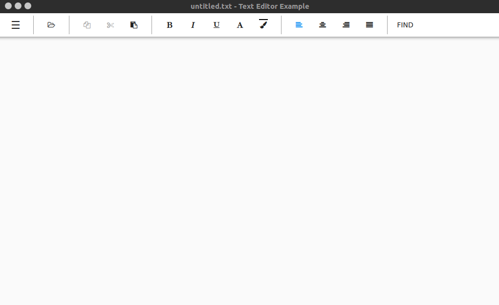
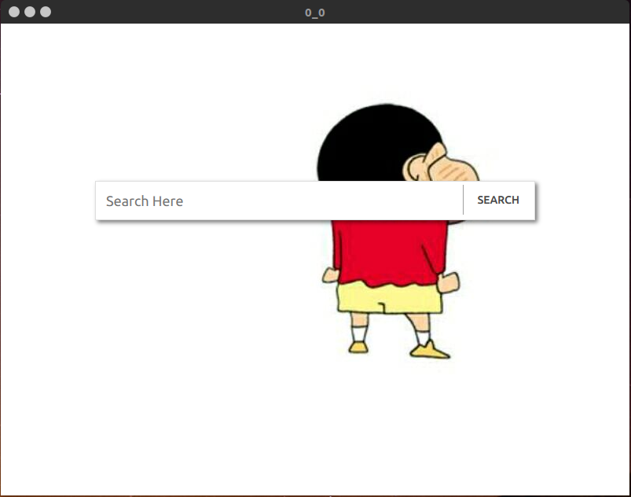
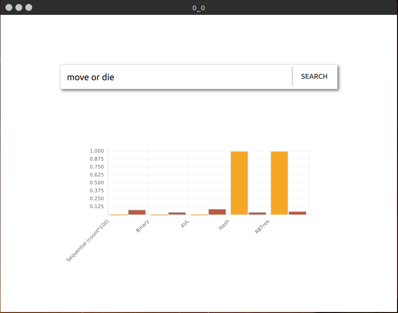

# SDU_DS_CDS  
Project for DataStructure, implemented several search algorithms

## Algorithms
Sequential Search
Binary Search
Red/Black Tree
AVL Tree
Hash

#### A text editor based on Qt

#### For searching

#### Comparing

## Environment

Ubuntu16.04

QT 5.10.1

Qt Creator 4.5

## The following is my summary of various search algorithms

### 1. Sequential Search
1. O(n)
2. Slow, with many operations
### 2. Binary Search
1. O(logn)
2. Divisoin is expensive, we can use shift to replace it.
 mid = (left +right) / 2  －> mid = (left + right) >> 1 
3. optimizing methods：
Fibonacci Search
### 3. Hash
1. Ｏ(1)
2. Hash function for string
3. the cost for saving is high
### 4. Binary Search Tree
1. O(logn)
2. Binary Search Tree
3. AVL Tree
4. Red/Black Tree
### 5. B-Tree
### 6. TrieTree
